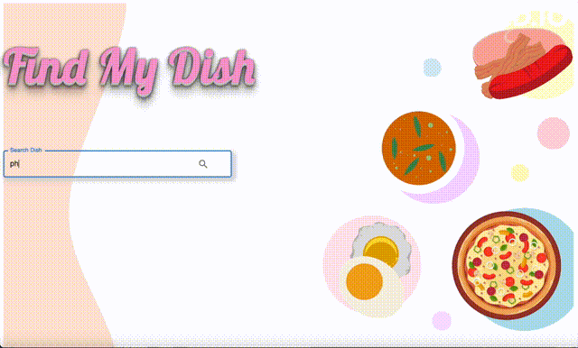
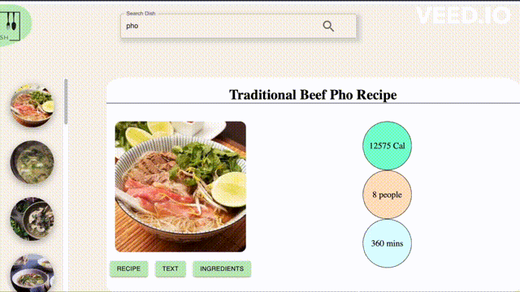

<h1 style="text-align:center" >Find My Dish</h1>

Tools used: 

<ul>
<li>HTML/CSS</li>
<li>React</li>
<li>Material UI</li>
<li>Node.js</li>
<li>Firebase</li>
<li>Express</li>
</ul>
<h6>Live on: <a href="https://find-my-dish.web.app">https://find-my-dish.web.app</a></h6>

***** the first search will take time to load because the server cools down after certain time of activity since it's a free service *****

<h3>Overall demo:</h3>

<h3>Text feature:</h3>

This is a recipe search website that utilizes the Edamam Api, unlocking access to over 10,000 recipes for you.

I had a blast building this project, getting my hands dirty with React hooks and learning the ropes of working with APIs. It's been an awesome sandbox for polishing my design skills and understanding how the front and back-end vibes together.

Looking ahead, I plan to spice things up by letting users create accounts to save their fav recipes, making it even easier to whip up a feast next time. Stay tuned for more cool updates!

